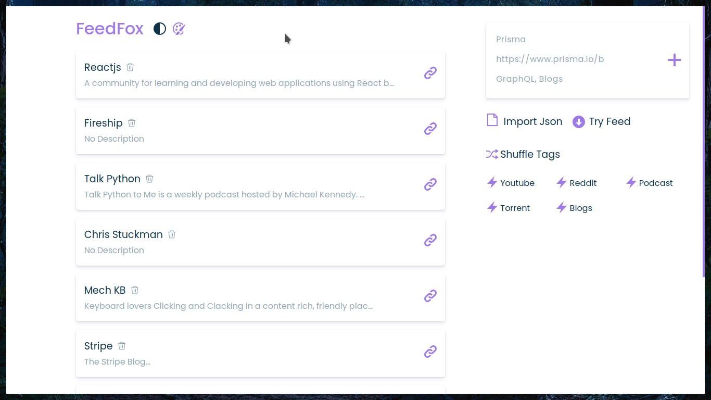
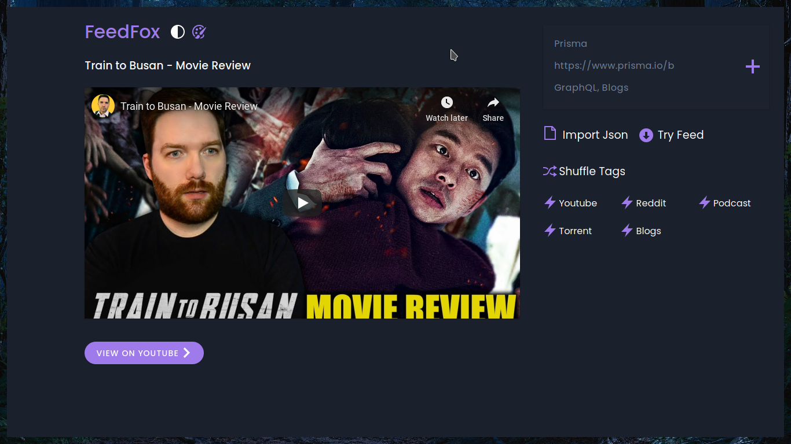
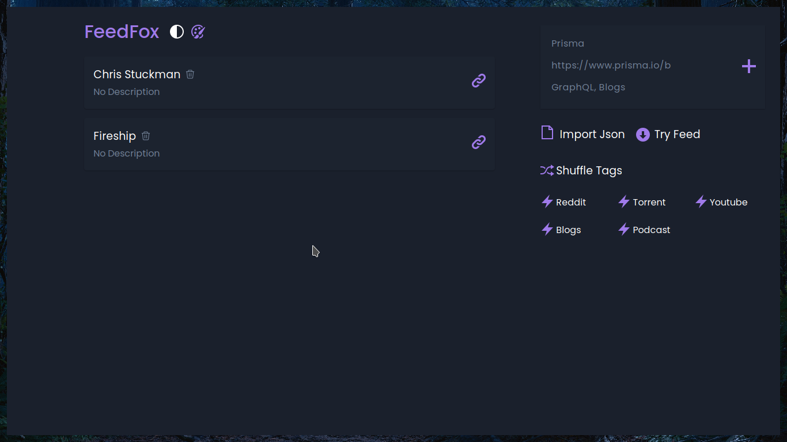
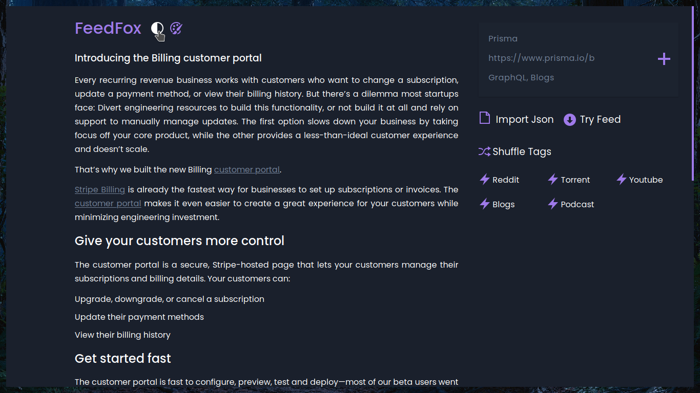

# FeedFox

FeedFox is an modern RSS reader that allows you to read blogs, play youtube videos, listen to podcasts, download torrents, browse reddit and twitter.

[Check out the deployed site](https://feedfox.netlify.com)

## Running it locally
You need to create a .env file at the root of the project. 

It contents should look like this:

```javascript
REACT_APP_API_KEY = "KEYHERE"  // get it from here: https://rss2json.com/sign-up
```
Then run <code>npm install && npm run start</code>

## UI

### Home (dark theme)


### Home (light theme)


### Individual Feed


### Feed


### View Feed By Tag


### Reading blogs

