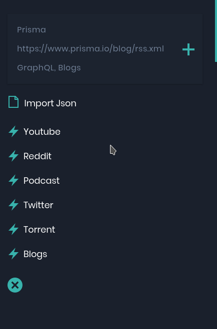
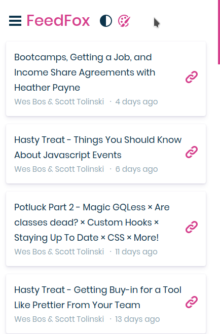

# FeedFox

FeedFox is a modern RSS reader that allows you to play youtube videos, listen to podcasts, download torrents, browser reddit, twitter and view cat GIFs 😾

# Running it locally
You need to create a .env file at the root of the project. 

It contents should look like this:

```javascript
REACT_APP_API_KEY = "KEYHERE"  // get it from here: https://rss2json.com/sign-up
```
Then run <code>npm install && npm run start</code>

# UI

## Dark


## Light


## Mobile layout
    

# TODO

1. Mobile layout [DONE🥳]
2. Better podcast player
