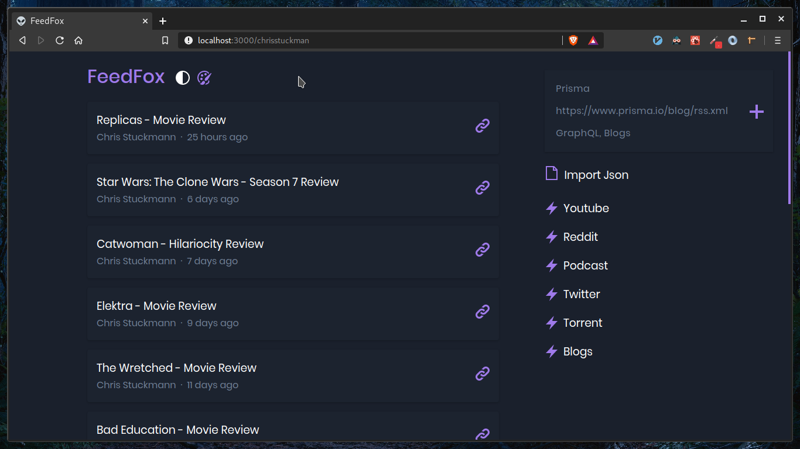

# FeedFox

FeedFox is a modern RSS reader that allows you to play youtube videos, listen to podcasts, download torrents, browser reddit, twitter and view cat GIFs 😾

# Running it locally

You need to have the file 'index.js' located in src/config/index.js.

The contents of the file should look this:

```javascript
export const API_KEY = "KEYHERE"  // get it from here: https://rss2json.com/sign-up
export const COUNT = 25  // amount of feeds to display
```
Then run <code>npm install && npm run start</code>

# UI

## Dark



## Light


# TODO

1. Mobile layout
2. Better podcast player
