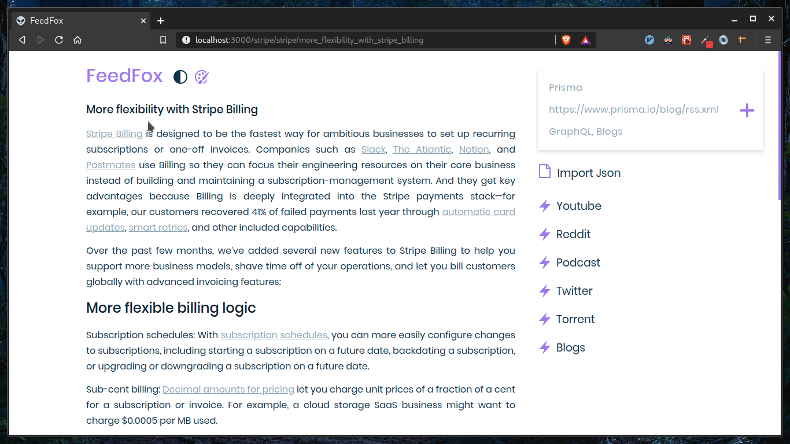

# ReactSS

ReactSS is a modern RSS reader that can play youtube videos, listen to podcasts, download torrents and view cat GIFs 😾

# Running it locally

You need to have the file 'index.js' located in src/config/index.js.

The contents of the file should look this:

```javascript
export const API_KEY = "KEYHERE"  // get it from here: https://rss2json.com/sign-up
export const COUNT = 25  // amount of feeds to display
```
Then run <code>npm install && npm run start</code>

# UI

## Dark


## Light



# TODO

1. Group feeds by Tags
2. Responsive Design
3. Better podcast player
